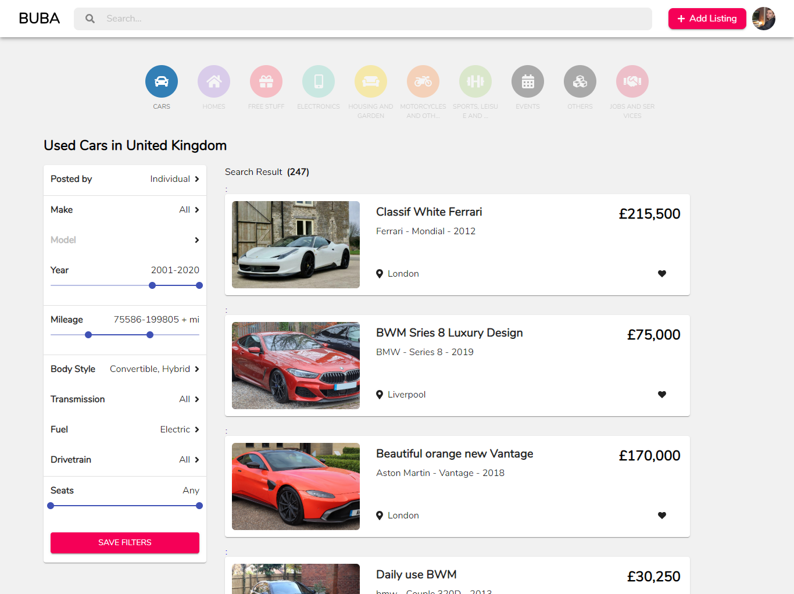

# Ogloszenia Anglia (UK Classified ADS)





[Ogloszenia Anglia Live Demo](https://ogloszenianglia.netlify.com/cars)

## Description


## Installation

Clone this repo to your local machine using: `git clone https://github.com/AurelianSpodarec/ogloszenia-anglia`

### Setup

```
npm install
```

<!-- https://ogloszenia-anglia.herokuapp.com/ -->
## Status
[](https://app.netlify.com/sites/ogloszenianglia/deploys)

[](https://dashboard.heroku.com/)

## Technologies used
* MongoDB
* ExpressJS
* ReactJS
* NodeJS

## Author

### Aurelian Spodarec
- [LinkedIn](https://www.linkedin.com/in/aurelianspodarec/)
- [Github](https://github.com/AurelianSpodarec)
- [Portfolio](http://aurelianspodarec.co.uk/)
- [Blog](http://lovetocode.com/)
- [New blog](https://creativeprogrammer.io/)

## Licence
MIT © Aurelian Spodarec